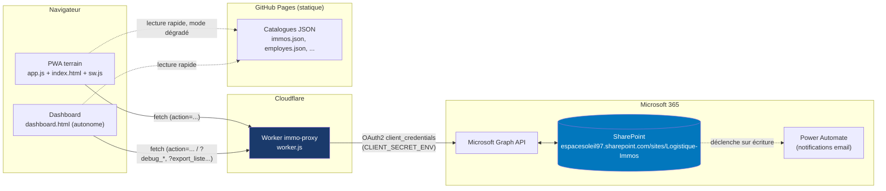

# Immo Tracker — Architecture globale

*Cartographie générée en lisant le code réel du dépôt (`worker.js`, `app.js`, `dashboard.html`, `index.html`, tests, config) le 9 août 2026 — pas seulement les documents `00_*` à `05_*`. Sert de vérification croisée de ces documents ; les écarts constatés sont listés en fin de fichier plutôt que silencieusement corrigés dans la doc existante. Comptes et tableaux repassés au réel le 11 août 2026 (passe de documentation, voir `04_HISTORIQUE_DECISIONS.md`).*

*⚠️ **Recomptage partiel le 9 septembre 2026** (session doc du module Besoin EPI/Consultations, voir `04_HISTORIQUE_DECISIONS.md`) : les **totaux** de la § 3 (actions, listes) ont été intégralement recalculés par script indépendant sur le code de ce jour — fiables. Le **détail nominatif** des tableaux `requireAdmin`/`requireGarant` a été complété (les 8 actions Brasseurs d'air + les 11 actions Consultations EPI manquaient) et est désormais exhaustif et vérifié également. En revanche, le reste du fichier (§ 1, § 2, § 5, § 6) n'a **pas** été intégralement revu à cette date — un mois de développement (Brasseurs d'air, Synthèse direction/CODIR, mode avancé PWA, contrat d'export universel...) s'est accumulé depuis le 11 août sans repasse complète ; seules les entrées directement utiles à la documentation du module EPI ont été ajoutées. Voir § 7 pour le détail des écarts encore ouverts.*

## 1. Schéma de la chaîne

Aucun appel direct navigateur → SharePoint : le Worker détient seul le secret Azure (`CLIENT_SECRET_ENV`), jamais exposé côté client — nécessaire car `worker.js` est public sur GitHub Pages.

## 2. Inventaire des modules et de leurs écrans

### PWA terrain (`app.js` + `index.html`, écrans `showScreen('screen-*')`)

| Module | Écrans |
|---|---|
| Activation / connexion | `screen-activation` (scan badge + saisie manuelle), `screen-login` (mot de passe dashboard), `screen-accueil` |
| Immobilisations (scan) | `screen-scan-immo`, `screen-etat`, `screen-accepter`, `screen-receveur`, `screen-scan-receveur`, `screen-confirmation` |
| Recherche / dépôt | `screen-stock-depot`, `screen-scan-recherche`, `screen-rechercher`, `screen-photos` |
| Attribution forcée (admin terrain) | `screen-scan-force`, `screen-force-attribution` |
| Réservations | `screen-reserver`, `screen-scan-resa`, `screen-modifier-resa`, `screen-mes-reservations`, `screen-reservations-admin` |
| Absences | `screen-signaler-absence` *(module non documenté dans 00-05, voir § 7)* |
| Campagne d'inventaire de stock | écran dédié "📋 Campagne d'inventaire" (saisie zone/référence/quantité, scan code-barres réutilisant `Html5Qrcode`) |

Pas d'écran PWA pour EPI, Outillage, Matériel IT, Lignes téléphoniques — ces modules sont **100% dashboard** (confirmé par grep : aucune de leurs actions n'apparaît dans `app.js`).

**Accueil simplifié (roadmap item E, ajouté août 2026)** : pour les profils avec `ROLE_CAPS.modeSimplifie` (`Logistique_Mayotte` seul à ce jour), `#screen-accueil` bascule vers un contenu réduit à 3 actions (`#accueil-simple`) plutôt que l'accueil habituel (`#accueil-normal`) — même écran, contenu reconstruit selon le rôle par `afficherEmploye()`. Nouvel écran dédié `screen-simple-recevoir`. Couche de présentation uniquement, mêmes actions Worker que le mode normal — voir `03_REGLES_METIER_ET_ROLES.md` § Mode simplifié PWA.

### Dashboard (`dashboard.html`, un seul fichier, tabs `data-tab`)

| Onglet | Fonctions de rendu principales |
|---|---|
| Vue générale | `renderVueGenerale` |
| Circulation | `renderCirc` |
| Dépôt | `renderDepot` |
| Transferts | `renderTransferts` |
| Réservations | `renderResa` (sous-vue "Liste") + `renderResaPlanning` (sous-vue "Planning" — demandes actionnables groupées par semaine/chantier, ajoutée août 2026, roadmap item D Lot 2) |
| Absences | `renderAbsences` *(non documenté dans 00-05)* |
| Alertes | `renderAlertes` |
| Historique | (rendu dans le même bloc que Circulation/mouvements) |
| Documents (FDS) | `renderDocs` |
| Maintenance | `renderMaint` |
| Inventaire stock | `renderInventaireStock`, `renderDetailCampagneInventaire` |
| EPI | `renderEPI`, `renderEPIVue`, `renderEPIDotations`, `renderEPIStock`, `renderEPIGrille`, `renderEPIPonctuelle`, `renderEPIHistorique`, `renderEPIHistMatrice`, `renderEPIHistConsommation`, `renderEPIBesoin` (sous-onglet "📋 Besoin annuel", ajouté sept. 2026), `renderEPIConsultations`/`renderEPIConsultationsInner` (sous-onglet "📑 Consultations" — comparatif d'offres et attribution rendus dans l'écran de détail d'une consultation, pas des sous-onglets séparés), `renderEPIFournisseurs` (sous-onglet "🏭 Fournisseurs") — module "Besoin EPI & Consultations fournisseurs", voir `04_HISTORIQUE_DECISIONS.md` |
| Prime d'outillage | `renderOutillage`, `renderOutillageVue`, `renderOutilStock`, `renderOutilGrille`, `renderOutilDistribution`, `renderOutilManquant`, `renderOutilPrime`, `renderOutilEmployeDetail`, `renderOutilHistorique`, `renderOutilHistMatrice`, `renderOutilHistConsommation` |
| Matériel IT | `renderMaterielIT`, `renderMaterielITTelephones`, `renderMaterielITLignes`, `renderMaterielITDetail`, `renderLigneTelDetail` |
| Analyses | `renderAnalyse` (VNC, export comptable, coûts réparation, top mouvementées...) |
| Synthèse direction (ajouté 11 août 2026, renommé depuis "CODIR" le 12 août) | `renderCodir` (identifiants internes inchangés) — écran de pilotage pour l'arbitrage direction (valeur du parc, coûts/réforme, adoption terrain, ROI avec hypothèse déclarée), réservé Admin + Encadrement (`peutVoirCodir`, PAS Logistique) — voir `04_HISTORIQUE_DECISIONS.md` |
| Utilisateurs (+ admin) | `renderUsers` — contient aussi les outils d'administration (ajout immo/employé, seed rôles/sites, dédoublonnage, export de sauvegarde — voir § 6) |

**Contrat d'export universel (ajouté 11 août 2026)** : tous les exports Excel/CSV de l'application passent désormais par une fonction unique, `exporterExcel(nomFichier, ongletsSpec)` (SheetJS), remplaçant les anciens exports CSV isolés. Les exports d'immobilisations partagent un socle de colonnes garanti (`SOCLE_IMMO_ENTETES`, incluant systématiquement le Territoire) via `socleImmoLigne(codeIM)`. Détail complet (contrat, périmètre couvert, gap connu sur les grilles de configuration EPI/Outillage) dans `04_HISTORIQUE_DECISIONS.md`.

## 3. Actions du Worker (`worker.js`) et niveau de protection

*Recompté au 9 septembre 2026 (session doc du module Besoin EPI/Consultations, script indépendant sur chaque bloc `if (action === '...')`, classification par présence de `requireAdmin(body)`/`requireGarant(body)` DANS le corps du bloc — pas par proximité de ligne, pour éviter tout faux positif de bloc voisin) — remplace le recomptage du 11 août 2026, qui n'incluait ni Brasseurs d'air (8 actions garant + 1 admin, module livré le 11 août lui-même, après ce recomptage) ni Consultations EPI (11 actions garant, sept. 2026).*

**104 actions POST** (`?action=<nom>`) exécutables au total, dispatchées après `const body = await request.json()`, dont 2 blocs retirés mais dont le nom reste réservé (`bulk_maj_immos`, `maj_duree_amort`, voir plus bas). Quatre catégories : **28 `requireAdmin`** + **54 `requireGarant`** (= 82, taille exacte du `Set` `GATED_ACTIONS_AUDIT`, `worker.js`) + **18 publiques partagées PWA** (`PWA_SHARED_ACTIONS`, `tests/security.gated-actions.test.js`) + **2 actions de connexion** (`verify_password`/`set_password`, qui produisent le jeton et ne peuvent donc pas déjà en exiger un).

### `requireAdmin` (28 actions — admin strict)

`reset_password`, `maj_droits`, `maj_site_employe`, `ajouter_immo`, `importer_affectation_immo`, `ajouter_employe`, `bulk_patch_immos`, `dedupe_employes`, `maj_actif`, `seed_immo_sites`, `seed_roles_sites`, `creer_campagne_inventaire_immos`, `cloturer_campagne_inventaire_immos`, `bulk_import_lignes_inventaire`, `bulk_import_tailles_epi`, `bulk_import_catalogue_epi`, `bulk_import_grille_dotation_epi`, `bulk_import_catalogue_outillage`, `bulk_maj_duree_outillage`, `bulk_import_grille_outillage`, `bulk_import_lignes_outillage`, `ajouter_materiel_it`, `bulk_import_materiel_it`, `bulk_import_mouvements_materiel_it`, `ajouter_ligne_telephonique`, `bulk_import_lignes_telephoniques`, `bulk_import_mouvements_lignes_telephoniques`, `migrer_mouvement_brasseur` *(+1 depuis le 11 août — migration one-shot de l'historique Brasseurs d'air, voir `04_HISTORIQUE_DECISIONS.md`)*

*(Ces 28 sont des actions POST. `export_liste` est aussi protégé `requireAdmin` mais c'est un endpoint GET distinct — voir le tableau des endpoints GET plus bas dans cette section.)*

### `requireGarant` (Admin + Logistique + Logistique_Mayotte — 54 actions)

`upload_fds`, `maj_site_immo`, `marquer_statut_immo`, `maj_panne`, `enregistrer_reparation`, `creer_campagne_inventaire`, `cloturer_campagne_inventaire`, `maj_taille_employe`, `maj_grille_dotation_epi`, `supprimer_grille_dotation_epi`, `ajouter_article_epi`, `bulk_maj_stock_epi`, `maj_stock_mini_epi`, `reception_commande_epi`, `generer_dotation_epi`, `generer_remise_ponctuelle_epi`, `emarger_dotation_epi`, `upload_fiche_epi`, `annuler_dotation_epi`, `maj_service_outillage`, `maj_grille_outillage`, `supprimer_grille_outillage`, `reception_commande_outillage`, `editer_stock_outillage`, `maj_stock_mini_outillage`, `distribuer_outillage`, `upload_fiche_outillage`, `annuler_ligne_outillage`, `maj_materiel_it`, `affecter_materiel_it`, `maj_ligne_telephonique`, `affecter_ligne_telephonique`, `annuler_transfert`, `maj_transfert`, `creer_mouvement_direct` *(35 actions historiques, inchangées depuis le 11 août)*, `ajouter_depot_brasseur`, `ajouter_reference_brasseur`, `creer_mouvement_brasseur`, `transfert_brasseur`, `creer_commande_brasseur`, `editer_commande_brasseur`, `reception_commande_brasseur`, `annuler_mouvement_brasseur` *(+8, module Brasseurs d'air, 11 août — manquaient de ce tableau jusqu'ici)*, `creer_fournisseur`, `editer_fournisseur`, `creer_consultation_epi`, `editer_consultation_epi`, `editer_ligne_consultation_epi`, `changer_statut_consultation_epi`, `creer_offre_epi`, `editer_offre_epi`, `editer_ligne_offre_epi`, `importer_lignes_offre_epi`, `reporter_catalogue_epi` *(+11, module Besoin EPI/Consultations, sept. 2026 — **aucune n'est `requireAdmin`**, un écart volontaire par rapport au cadrage initial du module, voir `04_HISTORIQUE_DECISIONS.md`)*

### Publiques — partagées avec la PWA terrain (badge sans mot de passe — 18 actions)

`verify_password`, `set_password` *(actions d'entrée qui produisent le jeton — ne peuvent pas déjà en exiger un ; désormais protégées par un verrou anti brute-force, voir § 8 — comptées à part des 18 ci-dessous, dans les "actions de connexion")*, `upload_photo`, `delete_photo`, `reserver`, `statut_resa`, `modifier_resa`, `transfert`, `declarer_panne`, `resoudre_panne`, `signaler_absence`, `ajouter_ligne_inventaire`, `supprimer_ligne_inventaire`, `enregistrer_scan_inventaire_immo`, `declarer_vol`, `valider`, `creer_retour_direct_garant` *(écrit un mouvement Retour/DEPOT direct pour un garant, même modèle de confiance que les autres actions de cette liste malgré son nom)*, `sortie_stock_brasseur_pwa`, `transfert_stock_brasseur_pwa`, `upload_fiche_brasseur` *(+3 depuis le 11 août — écran PWA "📦 Sortie de stock" du module Brasseurs d'air, voir `04_HISTORIQUE_DECISIONS.md`)*

⚠️ **Anomalie repérée le 9 septembre 2026, sans lien avec le module Besoin EPI, en scannant systématiquement le fichier pour ce recomptage** : `modifier_ligne_inventaire` (édition d'une ligne de comptage de stock d'articles, module distinct) est publique — exactement comme sa voisine `supprimer_ligne_inventaire` (même bloc `if`, même modèle de confiance auteur-ou-admin) — mais elle **n'apparaît pas** dans `PWA_SHARED_ACTIONS` (`tests/security.gated-actions.test.js`), contrairement à `supprimer_ligne_inventaire`. Aucun signe de bug de comportement (le code fonctionne, `security.gated-actions.test.js` passe car il ne vérifie pas l'exhaustivité côté public) — un oubli de classification dans la liste de suivi. Non corrigé (hors périmètre d'une session de documentation), signalé ici et dans `04_HISTORIQUE_DECISIONS.md`.

✅ **`maj_duree_amort` et `bulk_maj_immos` — orphelines, retirées (corrigé lors de l'audit du 9 août 2026)** : `maj_duree_amort` écrivait encore la colonne `Duree_Amortissement` sans aucune authentification, alors qu'aucun appel n'existe plus dans `dashboard.html`/`app.js` depuis le passage à la durée 100% automatique (voir `02_MODELE_DONNEES.md`) ; `bulk_maj_immos` est le même type de bloc orphelin, sur une action différente. Les deux sont neutralisées (`{ success: false, error: 'deprecated' }`) plutôt que supprimées, pour ne rien casser si un appel resterait en cache quelque part — ce sont les "2 blocs retirés" comptés à part des 104 actions actives en tête de cette section. Voir § 8 et `SECURITE_ETAT.md`.

### Endpoints GET en lecture (paramètres de requête, avant le branchement POST)

| Paramètre | Protection | Contenu |
|---|---|---|
| `?debug_immos=1`, `?debug_resa=1`, `?debug_transferts=1`, `?debug_employes=1`, `?debug_mouvements=1` | Aucune | Échantillon brut Graph (2-5 lignes) d'une liste, à but diagnostic |
| `?debug_inventaire_columns=1`, `?debug_columns=<liste>` | Aucune | Noms internes réels des colonnes d'une liste SharePoint |
| `?audit_site_immos=1` (ajouté 11 août 2026) | Aucune | Qualité de la donnée `Immos.Site` sur les immos actives (comptes Réunion/Mayotte/vide-invalide) — contrairement à `?immo_metadata=1`, ne masque jamais un Site vide en `'Reunion'` ; outil de contrôle qualité, voir `04_HISTORIQUE_DECISIONS.md` § Contrat d'export universel |
| `?next_code_im=1`, `?next_code_ligne_tel=1`, `?next_code_materiel_it=<préfixe>` | Aucune | Prochain code disponible |
| `?immo_metadata=1`, `?fds_map=1`, `?photos_map=1`, `?employes=1`, `?reservations=1`, `?transferts=1`, `?campagnes_inventaire=1`, `?lignes_inventaire=<id>`, `?campagnes_inventaire_immos=1`, `?scans_inventaire_immos=<nom>`, `?catalogue_epi=1`, `?grille_dotation_epi=1`, `?dotations_epi=1`, `?lignes_dotation_epi=<id>`, `?lignes_dotation_epi_toutes=1`, `?catalogue_outillage=1`, `?grille_outillage=1`, `?lignes_outillage=1`, `?materiel_it=1`, `?mouvements_materiel_it=1`, `?lignes_telephoniques=1`, `?mouvements_lignes_telephoniques=1`, `?absences=1`, `?maintenance=1`, `?mes_reservations=<code>`, `?dashboard=1` | Aucune | Données consolidées pour l'affichage dashboard/PWA — lecture seule mais sans authentification (cohérent avec le choix de conception documenté : friction minimale, PWA sans mot de passe) |
| `?photo=<id>`, `?photos=<code>`, `?fds=<code>`, `?fiche_epi=<id>`, `?fiche_outillage=<id>` | Aucune | Récupération de fichiers/photos déposés sur le drive SharePoint |
| `?codir=1` (ajouté 11 août 2026) | Aucune | Historique complet (tous statuts, y compris déjà validés) de `Transferts_En_Attente` — seule donnée non recomposable côté client à partir de `?dashboard=1`/`?immo_metadata=1`/`?reservations=1` déjà chargés, utilisée pour estimer le délai moyen de validation des transferts sur l'onglet CODIR. Même niveau de protection que `?dashboard=1` (déjà consommé sans jeton par Analyses) — voir `04_HISTORIQUE_DECISIONS.md` |
| `?fournisseurs=1`, `?epi_consultations=1`, `?epi_consultation_lignes=<id>` (ajoutés sept. 2026) | Aucune | Module Besoin EPI/Consultations — répertoire fournisseurs, en-têtes des consultations, lignes de besoin d'une consultation (quantités, jamais de prix) — public par cohérence avec les autres endpoints EPI déjà publics (`?catalogue_epi=1`), écart volontaire par rapport au cadrage initial du module qui proposait `requireGarant` ici aussi, voir `04_HISTORIQUE_DECISIONS.md` |
| **`?epi_offres=<id_consultation>&token=<jeton>`** (ajouté sept. 2026) | **`requireGarant`** | Offres reçues d'une consultation, avec leurs lignes de prix imbriquées (`lignes:[...]`) — seul endpoint du module à porter un prix, donc le seul protégé ; même mécanisme de jeton en paramètre que `?brasseurs_commandes=1` |
| **`?export_liste=<nom_liste>&token=<jeton>`** | **`requireAdmin`** | Export JSON complet d'une liste blanche de listes SharePoint (sauvegarde manuelle avant migration — voir `PROCEDURE_ROLLBACK.md`). Le jeton HMAC est transmis en query string (`&token=`) car requireAdmin attend normalement un corps JSON POST — adapté ici pour un GET |
| **`?journal_audit=1&token=<jeton>`** | **`requireAdmin`** | Lecture du journal d'audit des actions sensibles (`Journal_Audit`), même mécanisme de jeton en paramètre que `?export_liste=` |
| **`?digest=1&token=<DIGEST_TOKEN_ENV>`** | Secret dédié (comparaison à temps constant, pas `requireAdmin`/`requireGarant` — appelé par Power Automate sans utilisateur connecté) | Calcule et renvoie le digest hebdomadaire (6 règles), voir `01_ARCHITECTURE_TECHNIQUE.md` § Digest hebdomadaire |

⚠️ Cette table de endpoints GET n'a, comme les tableaux d'actions ci-dessus, pas été recomptée dans son intégralité le 9 septembre 2026 — seuls les 4 endpoints du module EPI ont été ajoutés. Plusieurs endpoints publics du module Brasseurs d'air (`?brasseurs_depots=1`, `?brasseurs_catalogue=1`, `?brasseurs_mouvements=1`, `?brasseurs_stock=1`, `?fiche_brasseur=`) et les 2 endpoints protégés `?brasseurs_commandes=1&token=`/`?brasseurs_lignes_commande=1&token=` (`requireGarant`, exposent des prix) manquent encore de cette table — voir § 7.

### Audit d'exhaustivité (méthode et résultat, 9 août 2026)

Script de comptage indépendant (regex sur chaque bloc `if (action === 'xxx') {`, classification par présence de `requireAdmin(body)`/`requireGarant(body)` sur la ligne suivante) recoupé avec `GATED_ACTIONS` de `dashboard.html` : **27 requireAdmin + 35 requireGarant = 62 actions protégées, exactement les 62 entrées de `GATED_ACTIONS` — aucun écart, ni manquant ni en trop.** Ce même recoupement est réévalué automatiquement à chaque `npm test` par `tests/security.gated-actions.test.js` (garde-fou anti-régression déjà en place depuis le chantier "Autorisation côté serveur") — cet audit manuel confirme simplement que l'état actuel est sain et documente le chiffre exact à cette date ; la vérification continue reste le test, pas cette page.

## 4. Listes SharePoint et relations

Site `espacesoleil97.sharepoint.com/sites/Logistique-Immos`. Aucune colonne `Lookup` SharePoint nulle part dans le modèle : toutes les relations parent/enfant se font par un champ texte simple portant le code/l'identifiant du parent (ex. `Title` d'une ligne = code de campagne, ou id numérique de la fiche parente) — choix de conception délibéré, cohérent sur l'ensemble du projet.

| Liste | Rôle | Relation |
|---|---|---|
| `Immos` | Catalogue des 1023 immobilisations | — |
| `Employes` | Collaborateurs (+ colonnes EPI, Service_Outillage) | — |
| `Mouvements` | Historique des transferts/retours/pannes/réparations/entretiens (une ligne = un événement) | `Title` = code immo |
| `Transferts_En_Attente` | Transferts/retours non encore validés par un garant | `Title` = code immo |
| `Reservations` | Réservations de matériel | `Code_IM` = code immo |
| `Absences` ⚠️ *non documentée dans 00-05* | Registre à sens unique des absences signalées | `Title` = code employé absent |
| `Campagnes_Inventaire` → `Lignes_Inventaire` | Campagnes de comptage du stock d'articles/consommables | `Lignes_Inventaire.Title` = nom de la campagne (texte, pas de lookup) |
| `Catalogue_Articles_EPI`, `Grille_Dotation_EPI` | Référentiels EPI (stock vivant, grille par profil) | — |
| `Dotations_EPI` → `Lignes_Dotation_EPI` | Fiches de dotation EPI + détail articles | `Lignes_Dotation_EPI.Title` = id SharePoint de la fiche parente |
| `Catalogue_Outillage`, `Grille_Outillage` | Référentiels outillage (stock vivant, kit par service) | — |
| `Lignes_Outillage` | État de distribution outillage (liste plate, pas de fiche séparée) | `Title` = code employé |
| `Materiel_IT` → `Mouvements_Materiel_IT` | Téléphones/ordinateurs + historique de détenteurs | `Mouvements_Materiel_IT.Title` = code appareil |
| `Lignes_Telephoniques` → `Mouvements_Lignes_Telephoniques` | Lignes téléphoniques (indépendantes des appareils) + historique | `Mouvements_Lignes_Telephoniques.Title` = code ligne |
| `Campagnes_Inventaire_Immos` → `Scans_Inventaire_Immos` | Campagnes d'inventaire physique des immobilisations par scan QR (distinctes de `Campagnes_Inventaire`/`Lignes_Inventaire`, stock d'articles) | `Scans_Inventaire_Immos.Title` = code immo scannée |
| `Journal_Audit` | Trace des actions sensibles (`requireAdmin`/`requireGarant`) et des échecs de connexion | — |
| `Fournisseurs` → `EPI_Consultations` → `EPI_Consultation_Lignes`, `EPI_Offres` → `EPI_Offres_Lignes` (ajoutées sept. 2026) | Module Besoin EPI/Consultations — répertoire fournisseurs, consultation figée + son besoin, offres reçues + leurs lignes de prix | `EPI_Consultation_Lignes.Title`/`EPI_Offres.Title` = id SharePoint de la consultation parente ; `EPI_Offres_Lignes.Title` = id de l'offre parente, `.Ligne_Consultation_Id` = id de la ligne de besoin correspondante (clé de rapprochement du réimport de cadre fournisseur) |

**32 listes SharePoint au total** (`EXPORTABLE_LISTS`, `worker.js`, recompté le 9 sept. 2026 — 22 au 11 août + 5 `Brasseurs_*` (11 août, absentes de ce tableau, voir § 7) + 5 EPI ci-dessus). *(Chantiers : voir écart § 7 — aucune liste SharePoint de ce nom n'est utilisée en pratique, `chantiers.json` est un fichier orphelin.)* **Bloquant avant usage réel du module EPI** : les 5 listes Consultations EPI n'existent encore sur aucun des deux sites (production, recette) au 9 septembre 2026 — voir la checklist dans `PROCEDURE_RECETTE.md`.

## 5. Fichiers du dépôt

| Fichier / dossier | Rôle |
|---|---|
| `index.html`, `app.js`, `sw.js`, `manifest.json`, `style.css` | PWA terrain (coquille + logique + mode hors-ligne) |
| `dashboard.html` | Dashboard encadrement, fichier HTML+CSS+JS autonome (~9000 lignes) |
| `worker.js`, `wrangler.toml` | Proxy sécurisé Cloudflare Worker vers Microsoft Graph |
| `immos.json` (tableau) | Catalogue léger courant, PWA + dashboard |
| `immos_full.json` (objet) | Catalogue complet, migration EBP uniquement |
| `employes.json` | Repli statique si le Worker est indisponible |
| `epi_catalogue.json`, `epi_grille_dotation.json`, `epi_personnel.json` | Données sources de la migration EPI (import one-shot, toujours référencées) |
| `outillage_catalogue.json`, `outillage_grille.json`, `outillage_lignes.json`, `outillage_services.json` | Données sources de la migration Outillage (toujours référencées) |
| `outillage_durees.json`, `outillage_grille_ajouts.json` | ⚠️ **Orphelins** — 0 référence dans `dashboard.html`/`app.js` (voir § 7) |
| `materiel_it_catalogue.json`, `materiel_it_mouvements.json` | Données sources de la migration Matériel IT (toujours référencées) |
| `inventaire_dec2025.json` | Données sources de la migration inventaire déc. 2025 (toujours référencé) |
| `chantiers.json` | ⚠️ **Orphelin** — 0 référence dans le code (voir § 7) |
| `logo.jpg`, `logo-dark.jpg`, `logo-icon.jpg`, `logos/` | Assets graphiques (fiches imprimables, favicon) |
| `package.json`, `scripts/check-dashboard.js`, `scripts/session-start.js`, `scripts/session-rollback.js` | Outillage de développement (vérif syntaxe, rollback de session) |
| `tests/*.test.js`, `tests/helpers/loadWorker.js` | Suite de tests `node --test`, Graph entièrement mocké |
| `.githooks/pre-push` | Bloque le push si `npm run verify` échoue |
| `.github/workflows/tests.yml`, `.github/workflows/deploy.yml` | CI (filet de sécurité tests) + déploiement GitHub Pages |
| `README.md` | Notes de développement (tests, hooks) |
| `PROCEDURE_ROLLBACK.md` | Procédure de rollback (cette session) |
| `00_CONTEXTE_PROJET.md` … `05_ROADMAP_EVOLUTIONS_FUTURES.md`, `CLAUDE.md` | Base de connaissance métier (chargée automatiquement par Claude Code via `CLAUDE.md`) |

## 6. Dépendances CDN

| Librairie | Où | Usage |
|---|---|---|
| Sentry Browser SDK 10.69.0 | `index.html` + `dashboard.html` | Observabilité (erreurs JS), tag `environment` distinct pwa/dashboard |
| `html5-qrcode` 2.3.8 (unpkg) | `index.html` uniquement | Scan QR/codes-barres (immos + inventaire stock) |
| Chart.js 4.4.0 | `dashboard.html` | Graphiques (Analyses) |
| SheetJS (`xlsx`) 0.18.5 | `dashboard.html` | Import Excel (stock EPI, import "Au dépôt") |
| html2canvas 1.4.1 + jsPDF 2.5.1 | `dashboard.html` | Génération PDF locale des fiches de dotation EPI (File System Access API) |
| pdf.js 3.11.174 | `dashboard.html` | Rendu 1ère page des PDF scannés (émargements EPI/Outillage) |
| Tesseract.js 5 (jsdelivr) | `dashboard.html` | OCR best-effort, import de scans EPI en lot |

Aucune de ces dépendances n'est installée via npm — chargement direct par balise `<script src="https://...">`, cohérent avec le principe "zéro build" du projet.

## 7. Écarts constatés entre le code réel et les documents 00-05

1. ~~**Module "Absences" totalement absent des docs 00-05.**~~ — **corrigé lors de la passe de documentation du 11 août 2026** : documenté dans `02_MODELE_DONNEES.md` (liste `Absences`) et `03_REGLES_METIER_ET_ROLES.md` (§ Module Absences, capacités `absences`/`voitAbsences` intégrées à la matrice des rôles).
2. ~~**`Chantiers` n'est pas une liste SharePoint utilisée en pratique**~~ — **corrigé le 11 août 2026** : ligne retirée de `02_MODELE_DONNEES.md` (« Autres listes »). `chantiers.json` (85 Ko) reste un fichier orphelin dans le dépôt — non supprimé (hors périmètre d'une passe de documentation, c'est un fichier de données pas du code), à nettoyer dans une session dédiée si confirmé inutile.
3. **Deux fichiers JSON orphelins supplémentaires** : `outillage_durees.json` et `outillage_grille_ajouts.json` (0 référence dans le code). Probablement les données sources du correctif documenté dans `04_HISTORIQUE_DECISIONS.md` (« Retour terrain Prime d'outillage : durée d'amortissement & prime annuelle ») — la migration a dû être appliquée une fois puis le code de chargement retiré, sans que les fichiers sources aient été nettoyés du dépôt. Toujours pas nettoyé (même raisonnement que le point 2).
4. ~~**Action Worker `maj_duree_amort` non protégée et orpheline**~~ — **corrigé lors de l'audit de sécurité du 9 août 2026** (voir § 3 et § 8, et `SECURITE_ETAT.md`) : neutralisée sur le modèle `bulk_maj_immos` (`{success:false, error:'deprecated'}`), plus aucune écriture possible sans authentification.
5. ~~**`ROLE_CAPS` a plus de capacités que les « cinq capacités possibles » présentées dans `03_REGLES_METIER_ET_ROLES.md`.**~~ — **corrigé le 11 août 2026** : l'introduction et la matrice de `03_REGLES_METIER_ET_ROLES.md` couvrent désormais les 11 capacités réelles (ajout de `absences`, `voitAbsences`, `gererInventaire`, `compterInventaire`, `modeSimplifie`) et les 10 rôles (ajout de `Compteur_Inventaire`, qui manquait de la matrice).
6. **Divergence de dates résolue en amont de cette session** : au démarrage, ce dépôt (`C:\Users\ral\immo-tracker`) avait un code à jour (dernier commit "Lot 3", 9 août) mais une documentation figée au 6 août (n'incluant pas Lot 3), tandis qu'un second dossier de travail (`Desktop\Immos`, non git) avait l'inverse — documentation à jour au 9 août mais code du 3 août. Les fichiers `00_*` à `05_*` et `CLAUDE.md` de ce dépôt ont été resynchronisés depuis `Desktop\Immos` (version confirmée la plus récente : elle mentionne déjà "Lot 3") avant de démarrer le travail de cette session. Si un autre poste/dossier existe encore avec une version divergente, il faudra le rapprocher séparément.
7. **Ce fichier lui-même stale d'un mois, repéré le 9 septembre 2026** : la cartographie n'avait pas été retouchée depuis le 11 août — un mois de développement entier (module Brasseurs d'air complet avec écran PWA, onglet Synthèse direction/CODIR, mode avancé PWA garant, contrat d'export universel, recherche globale devenue palette de commande, refonte visuelle + mode sombre, entre autres) s'est accumulé sans qu'aucun total ne soit revérifié. La session du 9 septembre a recompté les totaux d'actions/listes depuis le code réel (§ 3, § 4 — fiables) et complété le détail nominatif Brasseurs+EPI des tableaux `requireAdmin`/`requireGarant`, mais **n'a pas** repris entièrement § 1 (schéma), § 2 (inventaire des écrans, au-delà de la ligne EPI), § 5 (fichiers du dépôt), § 6 (dépendances CDN) ni le tableau des endpoints GET (au-delà des 4 ajoutés pour EPI) — ces sections peuvent encore omettre des modules entiers (Brasseurs d'air et Synthèse direction en particulier n'y figurent pas du tout). À reprendre dans une session de documentation dédiée si une cartographie complète redevient nécessaire.
8. **`NAV_INDEX` (palette de commande / recherche globale, `dashboard.html`) incomplet pour le module EPI, repéré le 9 septembre 2026** : liste 6 entrées EPI ("EPI › Stock", "EPI › Suggestion de commande", "EPI › Grille de dotation", "EPI › Dotations employés", "EPI › Remise ponctuelle", "EPI › Historique") mais pas les 3 sous-onglets ajoutés en septembre ("EPI › Besoin annuel", "EPI › Consultations", "EPI › Fournisseurs") — ces 3 écrans restent accessibles via les boutons de sous-onglet du module EPI mais pas via le raccourci `/`. Non corrigé (changement de comportement, hors périmètre d'une session de documentation), signalé pour une session dédiée.

*Aucun de ces écarts n'a jamais été corrigé silencieusement dans le comportement du code. Les points 1, 2 et 5 ont été corrigés dans `02_MODELE_DONNEES.md`/`03_REGLES_METIER_ET_ROLES.md` lors de la passe de documentation dédiée du 11 août 2026 (voir `04_HISTORIQUE_DECISIONS.md`) ; les points 3 et 6 (fichiers JSON orphelins) restent en l'état, décision volontaire de ne pas toucher aux fichiers de données dans une session de documentation. Les points 7 et 8, trouvés le 9 septembre 2026 en documentant le module Besoin EPI/Consultations, restent également en l'état pour la même raison — voir aussi le repère `modifier_ligne_inventaire` en fin de § 3 et le détail complet dans `04_HISTORIQUE_DECISIONS.md`.*

## 8. Audit et durcissement de sécurité (9-10 août 2026)

*Session dédiée, distincte des sessions fonctionnelles ci-dessus — objectif : durcir sans casser le modèle assumé de la PWA terrain (identité par badge scanné, sans mot de passe). Détail complet, y compris ce qui reste ouvert par choix de conception, dans `SECURITE_ETAT.md`.*

1. **Limitation de débit sur `verify_password`/`set_password`** : verrou progressif par code employé (30s → 5min → 15min selon le nombre d'échecs), compteur en mémoire du Worker (pas de KV/Durable Object provisionné, "best effort" documenté comme tel). La sonde utilisée par le dashboard pour savoir si un mot de passe existe déjà (`__probe__`) est explicitement exclue du comptage. Message explicite côté dashboard (`msgTropDeTentatives`).
2. **Vulnérabilité trouvée et corrigée : bypass `is_reset` dans `set_password`.** Un flag `body.is_reset` non authentifié permettait de sauter la vérification de l'ancien mot de passe — n'importe qui connaissant le code d'un employé pouvait écraser son mot de passe sans le connaître. Jamais envoyé par le dashboard en pratique (vérifié), donc correction sans impact sur l'usage réel. Retiré : la vérification ne dépend plus que de l'existence d'un hash, jamais d'un indicateur fourni par le client.
3. **Audit d'exhaustivité `GATED_ACTIONS`** : voir § 3, aucun écart trouvé (62/62). Action orpheline `maj_duree_amort` neutralisée (voir § 7 point 4).
4. **CORS resserré + en-têtes standards** : `Access-Control-Allow-Origin: '*'` remplacé par une réflexion dynamique limitée à `https://ral974.github.io` (fonction pure `corsOriginFor`, testée). Ajout de `X-Content-Type-Options`, `X-Frame-Options`, `Content-Security-Policy`, `Referrer-Policy`, `Strict-Transport-Security`, `Vary: Origin` sur toutes les réponses (un seul objet `cors` partagé par tous les `new Response(...)` du fichier, donc un seul point de correction).
5. **Scrubbing PII sur Sentry** : aucun `Sentry.setUser`/`captureException`/`captureMessage` explicite nulle part dans le projet (vérifié). Vecteur réel identifié : les breadcrumbs automatiques (clics DOM sur `.link-emp`/`.link-im` porteurs de `data-emp`/`data-cim`/`data-nom`, URLs de `fetch` GET avec un code en paramètre). `beforeBreadcrumb`/`beforeSend` ajoutés dans `index.html` et `dashboard.html` : les breadcrumbs `ui.click` sont supprimés entièrement, le reste passe par un scrubber heuristique (codes dans les paramètres d'URL connus, motif "NOM Prénom"/"Prénom NOM").
6. **Audit des secrets dans le dépôt public** — trois trouvailles corrigées :
   - `?debug_employes=1` faisait un echo brut de la réponse Graph, `MotDePasse` (hash PBKDF2) inclus. Redacté (`[redacted]`), les autres champs restent visibles (le diagnostic reste utile).
   - `?materiel_it=1` et `?lignes_telephoniques=1` renvoyaient des codes PIN/PUK/RIO/déverrouillage SIM réels sans aucune authentification. Protégés `requireGarant` (jeton en paramètre `&token=`, même mécanisme que `?export_liste=`) — sans impact PWA, ces deux modules sont 100% dashboard.
   - `materiel_it_catalogue.json` (fichier source de migration, toujours suivi par git) contenait les PIN/PUK/RIO/déverrouillage réels de 40 téléphones. Champs redactés dans l'arbre de travail actuel, **et historique git réécrit** (`git filter-repo`, décision confirmée par William) : le commit d'origine (`b48a4f7`) n'est plus atteignable depuis aucune branche/tag du dépôt distant après force-push. ⚠️ Constaté après coup : GitHub sert encore la page de ce commit par son SHA direct (orphelin, non rattaché à une branche) — purge côté GitHub à demander explicitement par William, et rotation des codes eux-mêmes toujours recommandée. Détail complet dans `SECURITE_ETAT.md`.
   - `dashboard.html` contient un code d'accès partagé en clair (`var PIN='ES974'`) avant l'écran de sélection d'identité. **Décision de William : conservé tel quel**, assumé explicitement comme un filtre cosmétique (l'authentification réelle reste le mot de passe par employé, vérifié serveur) — documenté dans `SECURITE_ETAT.md`.
7. **29 nouveaux tests** répartis sur 4 nouveaux fichiers (`worker.rate-limit.test.js` : 11, `worker.security-headers.test.js` : 7, `security.materiel-it-gets.test.js` : 10, `security.debug-employes-redaction.test.js` : 1) — suite complète passée de 33 à 62 tests à cette date, tous verts avant chaque commit de cette session (`npm run verify`, hook `pre-push`). *(Chiffre historique de cette session précise — la suite complète compte 171 tests au 11 août 2026, voir `04_HISTORIQUE_DECISIONS.md` pour les ajouts postérieurs : journal d'audit, demandes de matériel planifiées, digest, etc.)*
